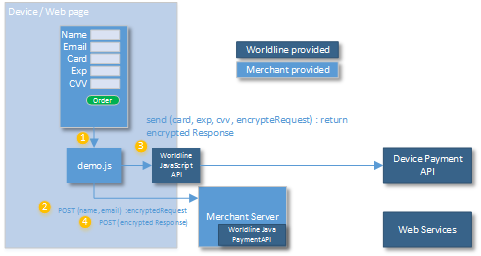

# Device Payment API Parameters

## Using the Device Payment API




The Worldline JavaScript API will manage the interaction with the 
Device Payment API, taking the card number details from the form. 
It also requires information that is provided by the merchant server side. 

For a hands-on example of how this can be done, check out the [Payment API spring boot demo 
application](https://github.com/WorldlineNordics/payment-api-spring-demo), that also
includes an example of use of the Worldline Online Payments Acceptance Javascript API.

### Getting Started
**Step 1.** First, acquire a PaymentHandler that will hold keys and addresses.
**Step 2.** Create a PaymentRequest

```java
PaymentHandler paymentHandler = new PaymentHandler(
        new JKSKeyHandlerV6("keystore.jks", "keystore-password",
                "merchant-alias", "worldline-alias"),
        "https://worldline-endpoint/");

PaymentRequest paymentRequest = new PaymentRequestBuilder()
        .setMid(1234567890L)
        .setOrderId("orderid")
        .setAmount(new BigDecimal(100.00))
        .setCurrency("USD")
        .setConsumerCountry("US")
        .setConsumerLanguage("en")
        .createPaymentRequest();
```

**Step 3.** Create the ```deviceAPIRequest```, a JSON string that is to be passed to the client SDK. The string holds the encrypted payload that the client passes on with payment details, the endpoint for the client to communicate with and an API version.

```java
String deviceAPIRequest = paymentHandler.createDeviceAPIRequest(paymentRequest);

```

#### Unpacking the encrypted response from Device Payment API
Upon return from the Device Payment API, the response must be decrypted in order
to retrieve details on the success of the transaction, stored token etc.

The response from the Device Payment API is gotten by unpack:

```java
PaymentResponse decodedResponse = paymentHandler.unpackResponse(response);
```
The decodedResponse then contains the transaction details needed for
determining the state of the transaction, like:

```java
decodedResponse.getStatus() // Easy interpreted status OK / NOK / ERROR / PENDING
decodedResponse.getTransaction() // Transaction Details.
decodedResponse.getTokenizationResult() // For Tokenized cards
```
For a complete list of response fields, see the [response table below](#response-details).

## Request Parameters
The following parameters may be used when initiating a Device PaymentAPI Request.

**Parameter**|**Required?**|**Comment**|**Valid values**|**Max length**
:-----|:-----:|-----|-----|-----
MID|Yes|Merchant ID| | 
Sub-merchant ID|No|Sub-merchant ID| | 
POS ID|No|Point Of Sale ID, default ”0”|Check with integration manager| 
Transaction channel|Yes|Default: ”Web Online”|Web Online, Mail, Telephone, Fax, FaceToFace, Cash Register | 
AutoCapture|No|Default: true|TRUE, FALSE| 
Token|No|Token of stored card| | 
Order ID|Conditional|Merchant assigned Order ID. Required, with exception of when the Store Flag is set to STORE_ONLY (2) | |50
Order description|No|Order description| | 
Order Detail Description|No|Order Detail Description| | 
Amount|Yes|Order amount,with decimal. Limit defined in integration|Example: 3.47| 
Currency|Yes|Three alphabetic letter, ISO-4217 code| |3
VAT amount|No|VAT (Value Added Tax) amount.| | 
VAT rate|No|VAT rate| | 
Country |Yes|Country code. ISO-3166, e.g. US. | |2
Language |Yes|Language. ISO 639-1, e.g. en. | |2
Time limit|No|Maximum time in seconds for request to be valid or zero if not used.| | 
Payment method ID |No|Used when the consumer selects the payment method at the merchant site. Default: 1000 (Unspecified card)| | 
Store Flag|No|Indicates that a token should be stored|0=NO_STORE - only Authorize/Debit, 1=STORE, and Debit/Authorize, 2=STORE_ONLY| 
Billing address line 1 |No|Billing address line 1| | 
Billing address line 2 |No|Billing address line 2| | 
Billing city|No|Billing city | | 
Billing state province |No |Billing state province | | 
Billing zip code|No|Billing zip code | | 
Billing country |No|Billing country code. ISO-3166, e.g. US. | | 
Billing e-mail address |No|Billing e-mail address| | 
Billing phone|No|Billing phone| | 
Billing mobile phone|No|Billing mobile phone number| | 
Billing Last Name|No|Billing Last Name. Will be concatenated with Billing first name to form a Billing full name.| | 
Billing First Name|No|Billing First Name. Will be concatenated with Billing last name to form a Billing Full Name| | 
Billing full name |Check with integration manager |Billing full name. Instead of using first+last name the full name can be submitted directly. | | 
Shipping address line 1|No|Shipping address line 1| | 
Shipping address line 2|No|Shipping address line 2 | | 
Shipping City|No|Shipping City| | 
Shipping State Province|No|Shipping State Province| | 
Shipping zip code|No|Shipping zip code| | 
Shipping Country|No|Shipping Country Code. ISO-3166, e.g. US.| | 
Shipping e-mail address|No|Shipping e-mail address| | 
Shipping phone|No|Shipping phone number| | 
Due date |No|Due date for payment. If not set, then max configured is used instead.| | 
Payment Plan Code|No|Payment plan code is used to break up a payment into multiple payments(paid over time, usually monthly). This code describes the length and type of installment that should be used| | 
Billing Company Name|No|Billing Company Name| | 
Billing buyer VAT number |No|Billing buyer VAT number | | 
Billing buyer type |No|Billing buyer type |Individual Business| 
Shipping Company Name|No|Shipping Company Name| | 
Shipping Address Line 3|No|Shipping Address Line 3| | 
Billing Address Line 3|No|Billing Address Line 3| | 
Birth date |No|Birth Date| | 
Company responsible birth date|No|Birth date of the responsible person at the company| | 
Company responsible full name|No|Full Name of the responsible person at the company| |50
Company responsible VAT number|No|VAT(Value Added Tax) number for the responsible person at the company| |25
POS description|No|POS description| | 
Shipping mobile phone|No|Shipping mobile phone| | 
Shipping Last Name|No|Shipping Last Name. Will be concatenated with Shipping first name to form a Shipping Full Name| | 
Shipping First Name|No|Shipping First Name. Will be concatenated with Shipping last name to form a Billing Full Name| | 
Shipping full name|No|Instead of using first+last name the full name can be submitetd directly| | 
Billing SSN|No|Billing Social Security Number| |30
Company tax ID|No|Company tax ID| |50
Gender|No|Gender, used for fraud screening for some payment methods| | 
Billing Street Name|No|Street name, used together with House Number instead of ”Address Line 1” for Klarna in certain countries| | 
Billing House Number|No|House Number, used together with Street Name instead of ”Address Line 1” for Klarna in certain countries| | 
Shipping Street Name|No|Shipping Street Name| | 
Shipping House Number|No|Shipping House Number| | 
Authorization Type |No|Authorization type: Mastercard now require merchants to define authorization attempts as either a pre-authorization or a final-authorization. Final authorizations that meetMastercard criteria will be free of scheme fee impact but pre-authorizations and undefined authorization attempts will be subject to additional scheme fees. |UNDEFINED, PRE\_AUTHORIZATION, FINAL\_AUTHORIZATION| 

## Response Details

**Parameter**|**Description**|**Example**
-----|-----|-----
Status|Transaction status. See below. | OK
MerchantId|MerchantId, same as in request. Assigned by Worldline | 1234567890
OrderId|OrderId, same as in request. Unique order ID assigned by merchant. | redbike-47123
POSId|Point of sale ID, same as in request. | 0
TransactionId|Worldline Transaction reference of the payment. | 12345678901
Payment method name|Payment Method name, either the resolved card payment method. | Mastercard, Nordea
Transaction Description|Description of the transaction performed | Transaction Accepted
Token | In case that the request was done with a request to store the payment method, the token represents the assigned token to use in further recurring transactions. | 9000123123112234
Token Masked Card | The masked card number, fist 6 and last 4, of the successful tokenization | 543215xxxxxx1234
Token Expiry date | The expiry of the card number that was tokenized | 03-2020
Currency | Currency used in the transaction | BRL
Order Amount | The amount expected to be paid on the transaction | 100.00
Fulfilment Amount | The amount that was successfully authorized with the acquirer | 100.00
Captured Amount | The amount that was requested to be captured. In this API, this would be the same as fulfilment amount if auto-capture flag was used in the request, otherwise 0. | 100.00
Refunded Amount | The amount requested to be refunded on the order. This is usable in split tender payments, where there could be several transactions on an order. | 0.00
Transaction State | A high-level state on the transaction; Processed, Declined or System Error. | Processed  


### Details on the Status
**Status**|**Description**
-----|-----
OK | The payment has been successfully processed.
NOK	| The payment was not completed. The user has used several attempts to submit a payment and ultimately been redirected back to the merchant due to exceeding the (configurable) maximum number of retries. NOK may also be returned if Worldline detects a possible fraud attempt. 
USERCANCEL | The consumer pressed a cancel button.
TIMEOUT | The consumer tried to initiate a payment after the timeout set by the merchant has expired.
PENDING |The final status of the payment is not yet determined. The final status of the payment will be notified via a notification, in a report or pulled from Worldline Web Interface depending on your setup. Note that this is an expected result for many payment methods.
ERROR |The Device Payment API has detected that there is something wrong in the URL content or the configuration of the merchant. If this result status is encountered, the merchant should review their parameters and contact Worldline if the problem cannot be identified.