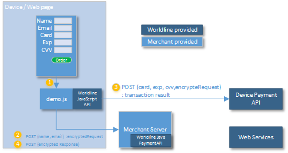

# Device Payment API Parameters

## Getting started with Device Payment API



The Worldline JavaScript API will manage the interaction with the 
Device Payment API, taking the card number details from the form. 
It also requires information that is provided by the merchant, server side, 
and for that purpose the PaymentRequestBuilder is used like this: 

```java
PaymentHandler paymentHandler = new PaymentHandler(
        new JKSKeyHandlerV6("merchant.jks", "password", "signkey", "encryptkey"),
        "https://worldline-endpoint/");

PaymentRequest paymentRequest = new PaymentRequestBuilder()
        .setMid(1234567890L)
        .setOrderId("orderid")
        .setAmount(new BigDecimal(100.00))
        .setCurrency("USD")
        .setConsumerCountry("US")
        .setConsumerLanguage("en")
        .createPaymentRequest();

String deviceAPIRequest = paymentHandler.createDeviceAPIRequest(paymentRequest);

```

The response from the Device Payment API is then interpred by calling unpack:

```java
PaymentHandler paymentHandler = new PaymentHandler(
        new JKSKeyHandlerV6("merchant.jks", "password", "signkey", "encryptkey"));

PaymentResponse decodedResponse = handler.unpackResponse(response);

```
The decodedResponse then contains the transaction details needed for
determining the state of the transaction, like:

```java
ecodedResponse.getStatus() // Easy interpreted status OK / NOK / ERROR / PENDING
decodedResponse.getTransaction() // Transaction Details.
decodedResponse.getTokenizationResult() // For Tokenized cards
```


## Request Parameters
The following parameters may be used when initiating a Device PaymentAPI Request.

**Parameter**|**Required?**|**Comment**|**Valid values**|**Max length**
:-----|:-----:|-----|-----|-----
MID|Yes|Merchant ID| | 
Sub-merchant ID|No|Sub-merchant ID| | 
POS ID|No|Point Of Sale ID, default ”0”|Check with integration manager| 
Transaction channel|Yes|Default: ”Web Online”|Web Online, Mail, Telephone, Fax, FaceToFace, Cash Register | 
AutoCapture|No|Default: true|TRUE, FALSE| 
Token|No|Token of stored card| | 
Order ID|Yes|Merchant assigned Order ID| |50
Order description|No|Order description| | 
Order Detail Description|No|Order Detail Description| | 
Amount|Yes|Order amount,with decimal. Limit defined in integration|Example: 3.47| 
Currency|Yes|Three alphabetic letter, ISO-4217 code| |3
VAT amount|No|VAT (Value Added Tax) amount.| | 
VAT rate|No|VAT rate| | 
Country |Yes|Country code. ISO-3166, e.g. US. | |2
Language |Yes|Language. ISO 639-1, e.g. en. | |2
Time limit|No|Maximum time in seconds for request to be valid or zero if not used.| | 
Payment method ID |No|Used when the consumer selects the payment method at the merchant site. Default: 1000 (Unspecified card)| | 
Store Flag|No|Indicates that a token should be stored|0=Store not used, 1=Store and Debit/Authorize, 2=Store only| 
Billing address line 1 |No|Billing address line 1| | 
Billing address line 2 |No|Billing address line 2| | 
Billing city|No|Billing city | | 
Billing state province |No |Billing state province | | 
Billing zip code|No|Billing zip code | | 
Billing country |No|Billing country code. ISO-3166, e.g. US. | | 
Billing e-mail address |No|Billing e-mail address| | 
Billing phone|No|Billing phone| | 
Billing mobile phone|No|Billing mobile phone number| | 
Billing Last Name|No|Billing Last Name. Will be concatenated with Billing first name to form a Billing full name.| | 
Billing First Name|No|Billing First Name. Will be concatenated with Billing last name to form a Billing Full Name| | 
Billing full name |Check with integration manager |Billing full name. Instead of using first+last name the full name can be submitted directly. | | 
Shipping address line 1|No|Shipping address line 1| | 
Shipping address line 2|No|Shipping address line 2 | | 
Shipping City|No|Shipping City| | 
Shipping State Province|No|Shipping State Province| | 
Shipping zip code|No|Shipping zip code| | 
Shipping Country|No|Shipping Country Code. ISO-3166, e.g. US.| | 
Shipping e-mail address|No|Shipping e-mail address| | 
Shipping phone|No|Shipping phone number| | 
Due date |No|Due date for payment. If not set, then max configured is used instead.| | 
Payment Plan Code|No|Payment plan code is used to break up a payment into multiple payments(paid over time, usually monthly). This code describes the length and type of installment that should be used| | 
Billing Company Name|No|Billing Company Name| | 
Billing buyer VAT number |No|Billing buyer VAT number | | 
Billing buyer type |No|Billing buyer type |Individual Business| 
Shipping Company Name|No|Shipping Company Name| | 
Shipping Address Line 3|No|Shipping Address Line 3| | 
Billing Address Line 3|No|Billing Address Line 3| | 
Birth date |No|Birth Date| | 
Company responsible birth date|No|Birth date of the responsible person at the company| | 
Company responsible full name|No|Full Name of the responsible person at the company| |50
Company responsible VAT number|No|VAT(Value Added Tax) number for the responsible person at the company| |25
POS description|No|POS description| | 
Shipping mobile phone|No|Shipping mobile phone| | 
Shipping Last Name|No|Shipping Last Name. Will be concatenated with Shipping first name to form a Shipping Full Name| | 
Shipping First Name|No|Shipping First Name. Will be concatenated with Shipping last name to form a Billing Full Name| | 
Shipping full name|No|Instead of using first+last name the full name can be submitetd directly| | 
Billing SSN|No|Billing Social Security Number| |30
Company tax ID|No|Company tax ID| |50
Gender|No|Gender, used for fraud screening for some payment methods| | 
Billing Street Name|No|Street name, used together with House Number instead of ”Address Line 1” for Klarna in certain countries| | 
Billing House Number|No|House Number, used together with Street Name instead of ”Address Line 1” for Klarna in certain countries| | 
Shipping Street Name|No|Shipping Street Name| | 
Shipping House Number|No|Shipping House Number| | 
Authorization Type |No|Authorization type: Mastercard now require merchants to define authorization attempts as either a pre-authorization or a final-authorization. Final authorizations that meetMastercard criteria will be free of scheme fee impact but pre-authorizations and undefined authorization attempts will be subject to additional scheme fees. |UNDEFINED, PRE\_AUTHORIZATION, FINAL\_AUTHORIZATION| 

## Response Details

**Parameter**|**Comment**
-----|-----
MerchantId|MerchantId, same as in request.
OrderId|OrderId, same as in request.
POSId|POSId, same as in request.
TransactionId|TransactionId
Payment method name|Payment Method name, either the resolved card payment method, e.g. Mastercard, or the explicitly requested, e.g. Nordea
Transaction Description|Description of the transaction performed
AnswerDescription|AnswerDescription