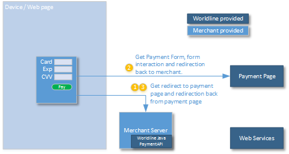

## Getting started with Payment Page integrations

The next kind of integration is using the Payment Page. This provides a convenient way 
of managing a payment integration, where Worldline Online Payments Acceptance manages
the payment form, interaction with the user on card details, and provides an easy
integration to 3DSecure and alternative payment methods. 



For creation of the redirect to Payment Page, follow this pattern:
```java
        PaymentPageHandler paymentPageHandler = 
            new PaymentPageHandler("URL", new JKSKeyHandlerV6("merchant.jks", "password", "merchant certificate", "drwp certificate"));


        PaymentPageRequest request = new PaymentPageRequest();
        request.setMid(1234567890L);
        request.setSubMerchantId("12");
        request.setPosId("ABC");
        request.setTransactionChannel("Web Online");
        request.setOrderId("orderid");
        request.setAmount(123.0);
        request.setCurrency("SEK");
        request.setConsumerCountry("SE");
        request.setConsumerLanguage("sv");
        request.setReturnUrl("http://merchant.com?f=3&f=q");
        request.setAuthorizationType(AuthorizationType.PRE_AUTHORIZATION);

        String redirectUrl = paymentPageHandler.createRedirectUrl(request);
```
